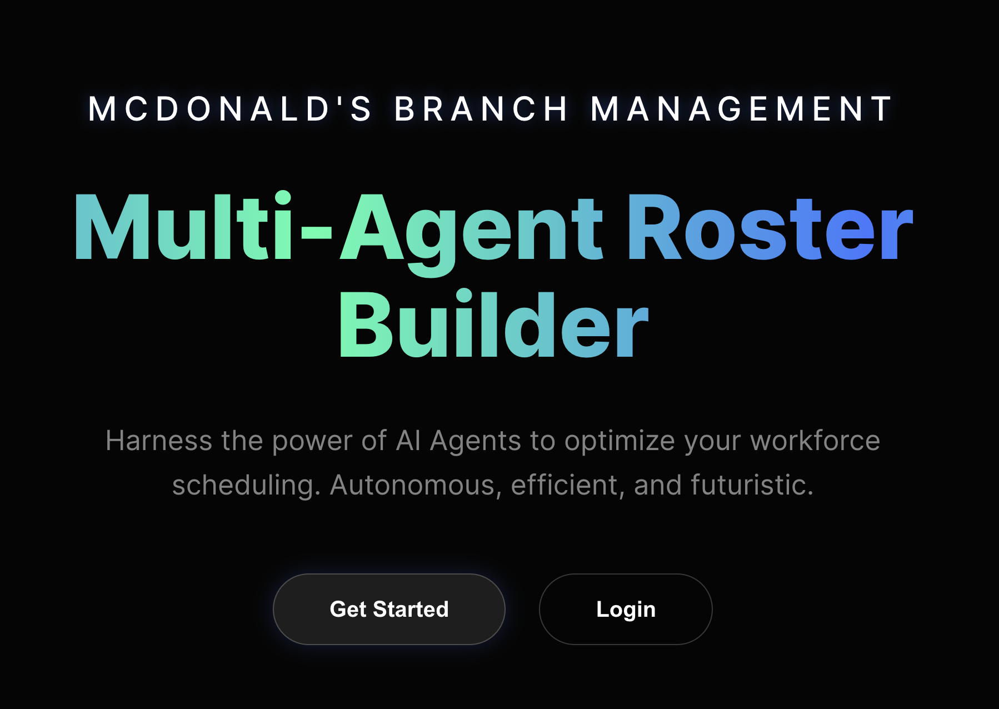
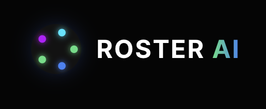

# Multi-Agent Roster Generation System



## Project Overview

A full-stack application that uses a sophisticated multi-agent AI system to generate optimized employee rosters for McDonald's stores. The system combines a modern React frontend, FastAPI backend, and LangChain/LangGraph-powered multi-agent orchestration to intelligently schedule employees while maximizing coverage (80-90%) and minimizing shortages.


## System Architecture

```
┌─────────────────────────────────────────────────────────────┐
│                        Frontend                             │
│  React + Vite + React Router                               │
│  - File Upload UI                                           │
│  - Real-time Progress Tracking                             │
│  - Roster Visualization                                     │
│  - RAG Chat Interface                                       │
└────────────────────┬──────────────────────────────────────┘
                     │ HTTP/REST API
                     │
┌────────────────────▼──────────────────────────────────────┐
│                      Backend                                │
│  FastAPI + SQLite + SQLAlchemy                         │
│  - Authentication (JWT)                                     │
│  - File Upload Handling                                     │
│  - API Endpoints                                            │
│  - RAG Chat Endpoint                                        │
└────────────────────┬──────────────────────────────────────┘
                     │ Orchestrator Call
                     │
┌────────────────────▼──────────────────────────────────────┐
│              Multi-Agent System Layer                      │
│  LangGraph State Machine Orchestrator                      │
│                                                             │
│  ┌──────────┐  ┌──────────┐  ┌──────────┐                │
│  │ Agent 1   │→ │ Agent 2   │→ │ Agent 3  │                │
│  │ Data      │  │ Constraints│  │ Roster   │                │
│  │ Parser    │  │ Analyzer  │  │ Generator│                │
│  └──────────┘  └──────────┘  └────┬─────┘                │
│                                     │                       │
│                              ┌──────▼─────┐                │
│                              │ Agent 4    │                │
│                              │ Validator  │                │
│                              └──────┬─────┘                │
│                                     │                       │
│                              ┌──────▼─────┐                │
│                              │ Agent 5    │                │
│                              │ Final Check│                │
│                              │ & Reports  │                │
│                              └────────────┘                │
│                                                             │
│  Shared State: MultiAgentState                             │
└─────────────────────────────────────────────────────────────┘
```

## Tech Stack

### Frontend
- **React 19.2.0** - UI framework
- **Vite 7.2.4** - Build tool
- **React Router DOM 7.10.1** - Routing
- **Framer Motion** - Animations

### Backend
- **FastAPI** - Web framework
- **SQLite** - Database
- **SQLAlchemy** - ORM
- **JWT** - Authentication

### Multi-Agent System
- **LangChain** - Agent framework
- **LangGraph** - State machine orchestration
- **OpenAI GPT-4o-mini** - LLM
- **Pydantic** - Structured output
- **Pandas** - Data processing
- **Pinecone** - Vector store (RAG)

## Project Structure

```
hackathon/
├── frontend/                 # React frontend application
│   ├── src/
│   │   ├── components/      # Reusable components
│   │   ├── pages/           # Page components
│   │   ├── services/        # API client
│   │   └── App.jsx          # Main app
│   ├── package.json
│   └── README.md            # Frontend documentation
│
├── backend/                  # FastAPI backend
│   ├── app/
│   │   ├── api.py           # API routes
│   │   ├── auth.py          # Authentication
│   │   ├── db.py            # Database
│   │   └── models.py        # Data models
│   ├── multi_agents/        # Multi-agent system
│   │   ├── orchestrator.py  # LangGraph orchestrator
│   │   ├── shared_state.py  # Shared state
│   │   ├── agent_1/         # Data parser
│   │   ├── agent_2/         # Constraints analyzer
│   │   ├── agent_3/         # Roster generator
│   │   ├── agent_4/         # Validator
│   │   ├── agent_5/         # Final check
│   │   ├── rag/             # RAG system
│   │   └── README.md        # Multi-agent docs
│   ├── main.py              # Entry point
│   ├── requirements.txt     # Dependencies
│   └── README.md            # Backend documentation
│
└── README.md                 # This file
```

## Quick Start

### Prerequisites

- **Node.js 18+** and npm
- **Python 3.10+**
- **SQLite** - Database (included, no setup needed)
- **OpenAI API key**

### 1. Clone Repository

```bash
git clone <repository-url>
cd hackathon
```

### 2. Backend Setup

```bash
cd backend

# Install dependencies
pip install -r requirements.txt

# Create .env file
cat > .env << EOF
# SQLite (included, no setup needed) is automatically created at backend/roster.db
# No DATABASE_URL needed - SQLite is used by default
SECRET_KEY=your-secret-key-here
OPENAI_API_KEY=your-openai-api-key
PINECONE_API_KEY=your-pinecone-key  # Optional
EOF

# Start backend server
python main.py
```

Backend runs on `http://localhost:8000`

### 3. Frontend Setup

```bash
cd frontend

# Install dependencies
npm install

# Start dev server
npm run dev
```

Frontend runs on `http://localhost:5173`

### 4. Access Application

- Open browser to `http://localhost:5173`
- Register an admin account
- Upload employee (.xlsx) and store (.csv) files
- Generate roster via multi-agent system

## Running Individual Components

### Running Only Backend

```bash
cd backend
python main.py
# or
uvicorn app.api:app --host localhost --port 8000 --reload
```

### Running Only Frontend

```bash
cd frontend
npm run dev
```

### Running Only Agents (Direct)

```python
from backend.multi_agents.orchestrator import run_full_pipeline

result = run_full_pipeline(
    employee_file="path/to/employee.xlsx",
    store_requirement_file="path/to/stores.csv",
    management_store_file="path/to/managment_store.json",
    rules_file="path/to/rules.json",
    store_rules_file="path/to/store_rule.json",
)
```

### Running Full Integrated Stack

1. Start SQLite (included, no setup needed)
2. Start backend: `cd backend && python main.py`
3. Start frontend: `cd frontend && npm run dev`
4. Access frontend at `http://localhost:5173`

## Environment Variables

### Backend (.env)

```env
# Database
# SQLite (included, no setup needed) is automatically created at backend/roster.db
# No DATABASE_URL needed - SQLite is used by default

# Authentication
SECRET_KEY=your-secret-key-here
ALGORITHM=HS256
ACCESS_TOKEN_EXPIRE_MINUTES=30

# LLM & Agents
OPENAI_API_KEY=your-openai-api-key

# Optional: RAG System
PINECONE_API_KEY=your-pinecone-key
PINECONE_ENVIRONMENT=your-pinecone-env
PINECONE_INDEX_NAME=roster-index
```

### Frontend

No environment variables required. API URL is configured in `src/services/api.js`.

## How Agents Communicate

### Communication Flow

1. **Frontend → Backend**: HTTP POST to `/generate-roster`
2. **Backend → Orchestrator**: Calls `run_full_pipeline()`
3. **Orchestrator → Agents**: LangGraph state machine routes between agents
4. **Agents → Shared State**: Agents read/write to `MultiAgentState`
5. **Orchestrator → Backend**: Returns final state with results
6. **Backend → Frontend**: JSON response with roster, violations, coverage

### Shared State Communication

All agents communicate through `MultiAgentState`:

- **Agent 1** writes: `employee_data`, `store_requirements`, `management_store`
- **Agent 2** writes: `constraints`, `rules_data`
- **Agent 3** writes: `roster`, `roster_metadata`
- **Agent 4** writes: `violations`, `iteration_count`
- **Agent 5** writes: `final_check_report`

Each agent reads the full state and writes partial updates.

### LangGraph Routing

- **Sequential Flow**: Agent 1 → Agent 2 → Agent 3 → Agent 4
- **Conditional Loop**: Agent 4 routes back to Agent 3 if violations found
- **Termination**: Agent 4 routes to Agent 5 when complete
- **Final Step**: Agent 5 ends workflow

## Project Concept

### Multi-Agent Roster Generation for McDonald's

This system solves the complex problem of generating optimal employee schedules for McDonald's stores by:

1. **Parsing Complex Data**: Employee availability, store requirements, management rules
2. **Analyzing Constraints**: Labor laws, shift limits, rest periods, penalty rates
3. **Intelligent Scheduling**: LLM-powered assignment optimizing for coverage and shortages
4. **Validation**: Comprehensive compliance checking
5. **Iterative Refinement**: Automatic regeneration until targets met
6. **Reporting**: Detailed coverage and compliance reports

### Key Features

- **80-90% Coverage Target**: Maximizes employee shift assignments
- **Shortage Minimization**: Ensures all stations are properly staffed
- **Compliance Validation**: Checks against all rules and constraints
- **Iterative Improvement**: Automatically refines roster until optimal
- **RAG-Powered Chat**: Natural language queries about rosters

### Agent Responsibilities

- **Agent 1**: Parse and structure input files
- **Agent 2**: Extract and structure constraints from rules
- **Agent 3**: Generate optimized roster schedule (LLM-powered)
- **Agent 4**: Validate roster for violations
- **Agent 5**: Final check and comprehensive reporting

## API Endpoints

### Authentication
- `POST /register` - User registration
- `POST /login` - User login
- `POST /logout` - User logout
- `GET /dashboard` - Get current user

### Roster Management
- `POST /upload-roster` - Upload employee/store files (admin)
- `POST /generate-roster` - Generate roster via agents (admin)
- `GET /get-roster` - Get current roster status
- `GET /download-roster/{filename}` - Download Excel roster (admin)
- `GET /download-report/{filename}` - Download report (admin)

### RAG Chat
- `POST /chat` - Natural language roster queries

## Multi-Agent Workflow

```
User Uploads Files
    ↓
POST /upload-roster
    ↓
POST /generate-roster
    ↓
LangGraph Orchestrator
    ├── Agent 1: Parse data
    ├── Agent 2: Analyze constraints
    ├── Agent 3: Generate roster
    ├── Agent 4: Validate roster
    │   └── Loop if violations (max 4 iterations)
    └── Agent 5: Final check & reports
    ↓
Return Results
    ├── Roster Excel file
    ├── Coverage metrics (80-90% target)
    ├── Violations list
    └── Comprehensive reports
```

## File Structure

### Input Files (Uploaded)
- **Employee Data**: `.xlsx` or `.csv` with employee availability
- **Store Requirements**: `.csv` with staffing requirements
- **Config Files**: `managment_store.json`, `rules.json`, `store_rule.json`

### Output Files (Generated)
- **Roster**: `roster.xlsx` - Generated schedule
- **Reports**: `final_roster_check_report.txt/json` - Validation reports

## Development Workflow

1. **Backend Development**:
   - Modify agents in `backend/multi_agents/`
   - Update API routes in `backend/app/api.py`
   - Test with Postman or curl

2. **Frontend Development**:
   - Modify components in `frontend/src/components/`
   - Update pages in `frontend/src/pages/`
   - Test with backend running

3. **Agent Development**:
   - Modify agent logic in `backend/multi_agents/agent_N/`
   - Update orchestrator routing in `backend/multi_agents/orchestrator.py`
   - Test agent directly or via API

## Testing

### Backend Testing

```bash
cd backend
python -m pytest  # If tests exist
# Or manual testing via Postman/curl
```

### Frontend Testing

```bash
cd frontend
npm test  # If tests exist
# Or manual testing in browser
```

### Integration Testing

1. Start backend and frontend
2. Register admin user
3. Upload test files
4. Generate roster
5. Verify coverage metrics (80-90%)
6. Check violations
7. Download roster and reports

## Production Deployment

### Backend

1. Set production environment variables
2. Use production database
3. Configure CORS for frontend domain
4. Use production ASGI server:
   ```bash
   gunicorn app.api:app -w 4 -k uvicorn.workers.UvicornWorker
   ```

### Frontend

1. Build production bundle:
   ```bash
   cd frontend
   npm run build
   ```
2. Serve `dist/` with nginx or similar
3. Configure API URL for production backend

### Multi-Agent System

- Agents run within backend process
- No separate deployment needed
- Ensure OpenAI API key has sufficient quota

## Troubleshooting

### Backend Won't Start
- SQLite runs automatically - no server needed
- Verify `.env` file exists and has correct values
- Check port 8000 is available

### Frontend Can't Connect
- Verify backend is running on `http://localhost:8000`
- Check CORS configuration in backend
- Verify API_URL in `frontend/src/services/api.js`

### Agents Not Working
- Verify OpenAI API key is set
- Check file paths in `multi_agents/dataset/`
- Review agent logs for errors
- Ensure all dependencies installed

### Coverage Not Meeting Targets
- Check employee availability data quality
- Verify constraints aren't too strict
- Review Agent 3 system prompt
- Check iteration limit (max 4)

## Documentation

- **Frontend**: See `frontend/README.md`
- **Backend**: See `backend/README.md`
- **Multi-Agent System**: See `backend/multi_agents/README.md`


> **Fun Fact**: The ROSTER AI logo features 5 glowing dots arranged in a circle, with each dot representing one of the 5 specialized agents in our multi-agent orchestration system (Data Parser, Constraints Analyzer, Roster Generator, Validator, and Final Check). This visual representation symbolizes the collaborative workflow where each agent plays a crucial role in generating optimal employee schedules.



## Future Improvements

- **Real-time Progress**: WebSocket for live agent updates
- **Parallel Agents**: Run independent agents concurrently
- **ML Optimization**: Learn from historical rosters
- **Multi-Store**: Optimize across multiple stores
- **Advanced RAG**: More sophisticated retrieval strategies
- **Agent Memory**: Long-term learning from patterns
- **Dashboard Analytics**: Visual coverage and compliance metrics
- **Mobile App**: React Native mobile interface

## Contributing

- **Made with ❤️ by aayushmaan**
- **Thank you StarPlan**
